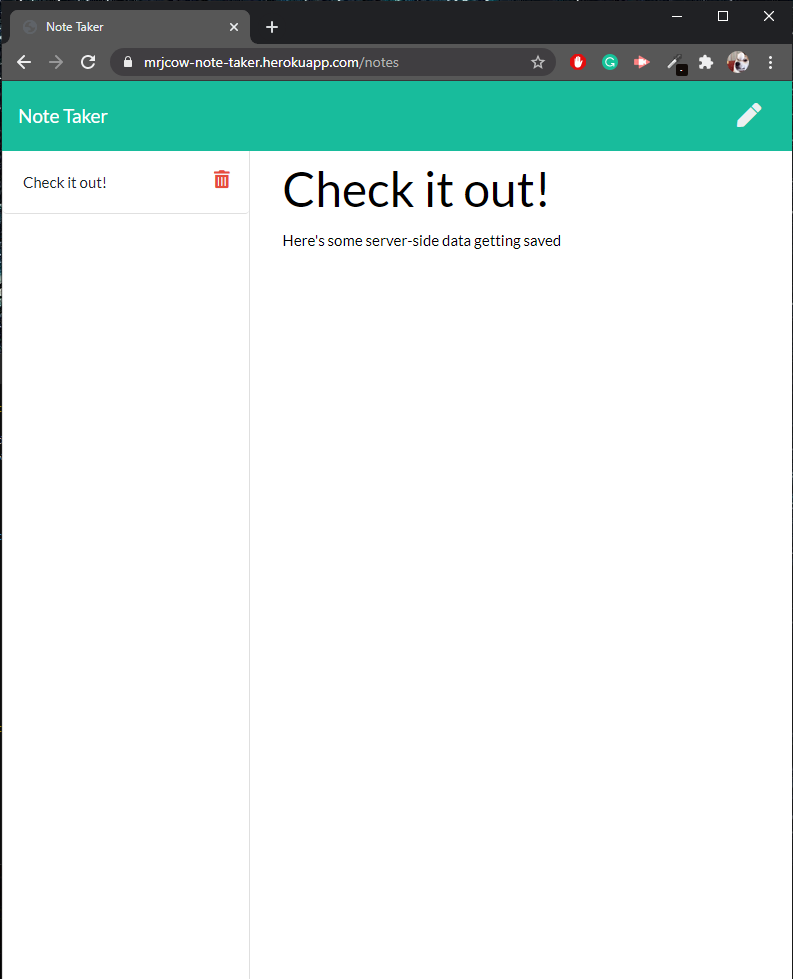

# Note Taker

An application that can be used to write, save, and delete notes that persist on a server JSON database.

[Deployed Site: https://mrjcow-note-taker.herokuapp.com/](https://mrjcow-note-taker.herokuapp.com/)

## Table of Contents
1. [Status](#status)
2. [Questions](#questions)

## Status

## Questions
If you have any questions, you can ask Mrjcowman at Mrjcowman@gmail.com or through GitHub at [their profile](https://github.com/Mrjcowman)
